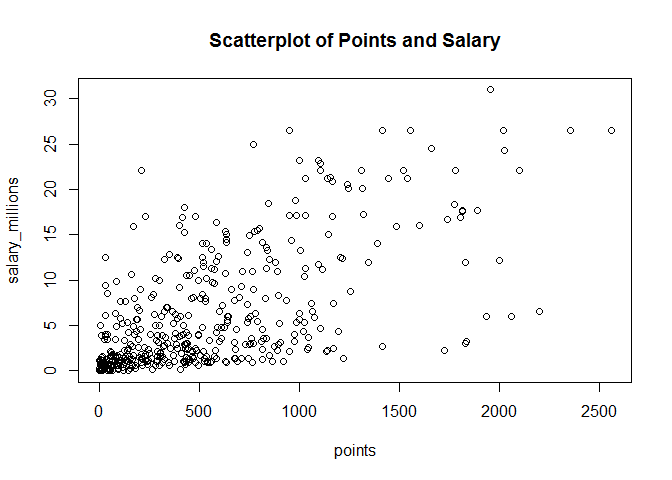
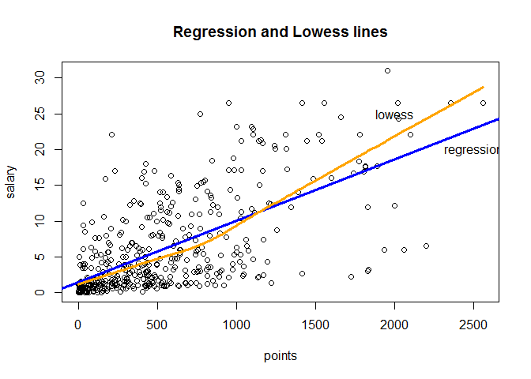
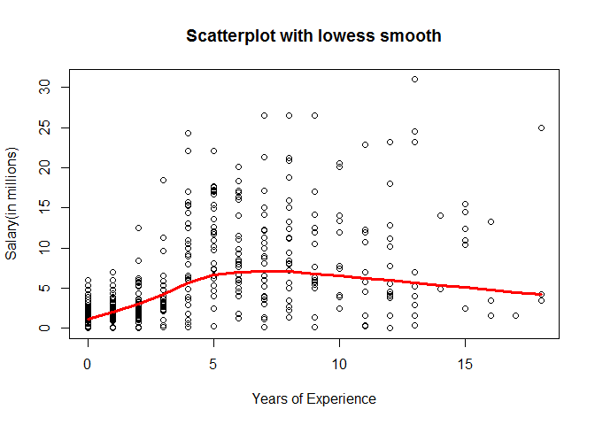
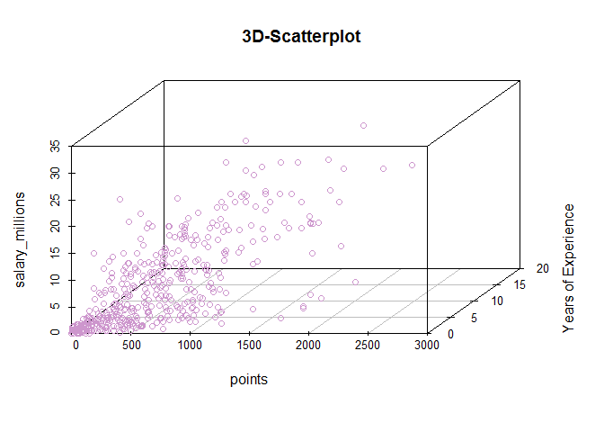
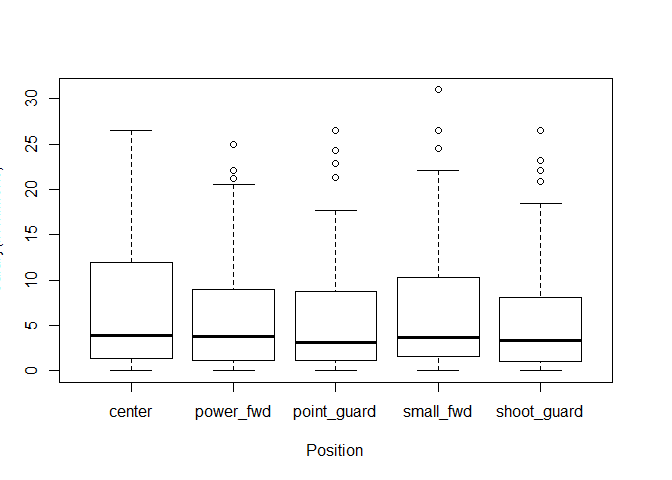

hw01-Tiantian-Fu.Rmd
================

importing the data

``` r
#load data file
load("data/nba2017-salary-points.RData")
#list the available objects
ls()
```

    ## [1] "experience" "player"     "points"     "points1"    "points2"   
    ## [6] "points3"    "position"   "salary"     "team"

1.  bit of data preprocessing

``` r
#New salary variable mearsured in millions of dollars.
salary_millions <- salary/1000000
summary(salary_millions)
```

    ##      Min.   1st Qu.    Median      Mean   3rd Qu.      Max. 
    ##  0.005145  1.286160  3.500000  6.187014  9.250000 30.963450

``` r
#replace the values "R" by "0"
experience[experience=="R"]=0
list(experience)
```

    ## [[1]]
    ##   [1] "9"  "11" "6"  "0"  "9"  "5"  "4"  "2"  "0"  "6"  "1"  "3"  "2"  "1" 
    ##  [15] "4"  "10" "12" "11" "5"  "1"  "5"  "12" "13" "0"  "8"  "13" "5"  "13"
    ##  [29] "15" "5"  "2"  "5"  "1"  "7"  "7"  "0"  "0"  "4"  "10" "2"  "1"  "5" 
    ##  [43] "0"  "6"  "7"  "2"  "4"  "7"  "1"  "0"  "8"  "8"  "6"  "9"  "5"  "3" 
    ##  [57] "0"  "0"  "3"  "0"  "3"  "12" "8"  "11" "4"  "12" "0"  "14" "3"  "10"
    ##  [71] "3"  "10" "3"  "3"  "6"  "2"  "17" "4"  "4"  "0"  "3"  "8"  "4"  "1" 
    ##  [85] "9"  "0"  "3"  "8"  "12" "11" "0"  "7"  "1"  "6"  "6"  "5"  "11" "1" 
    ##  [99] "6"  "1"  "9"  "8"  "1"  "1"  "1"  "0"  "13" "3"  "1"  "5"  "2"  "3" 
    ## [113] "2"  "0"  "10" "8"  "4"  "8"  "4"  "7"  "9"  "1"  "1"  "6"  "0"  "0" 
    ## [127] "2"  "13" "7"  "1"  "4"  "4"  "12" "1"  "1"  "0"  "6"  "5"  "3"  "5" 
    ## [141] "0"  "3"  "5"  "1"  "5"  "4"  "1"  "1"  "3"  "1"  "4"  "2"  "5"  "9" 
    ## [155] "11" "4"  "4"  "8"  "9"  "0"  "13" "0"  "8"  "7"  "9"  "3"  "1"  "4" 
    ## [169] "5"  "0"  "0"  "0"  "0"  "9"  "0"  "2"  "5"  "9"  "8"  "2"  "2"  "4" 
    ## [183] "8"  "7"  "0"  "1"  "5"  "0"  "0"  "4"  "0"  "0"  "7"  "1"  "8"  "0" 
    ## [197] "1"  "2"  "1"  "3"  "4"  "0"  "1"  "6"  "0"  "4"  "3"  "8"  "0"  "0" 
    ## [211] "6"  "2"  "2"  "2"  "4"  "10" "1"  "2"  "2"  "6"  "12" "0"  "13" "4" 
    ## [225] "3"  "2"  "8"  "9"  "1"  "5"  "13" "0"  "11" "7"  "13" "0"  "7"  "11"
    ## [239] "0"  "0"  "3"  "9"  "1"  "5"  "2"  "10" "14" "7"  "15" "15" "2"  "0" 
    ## [253] "2"  "8"  "0"  "7"  "0"  "11" "1"  "4"  "8"  "1"  "12" "0"  "7"  "4" 
    ## [267] "6"  "11" "0"  "11" "8"  "0"  "10" "16" "8"  "8"  "18" "11" "6"  "5" 
    ## [281] "13" "1"  "6"  "8"  "6"  "3"  "2"  "15" "0"  "1"  "2"  "3"  "5"  "1" 
    ## [295] "0"  "3"  "0"  "2"  "5"  "2"  "1"  "4"  "12" "5"  "8"  "0"  "3"  "7" 
    ## [309] "3"  "0"  "8"  "5"  "0"  "2"  "2"  "1"  "8"  "9"  "12" "3"  "18" "0" 
    ## [323] "0"  "15" "6"  "3"  "3"  "4"  "6"  "6"  "0"  "2"  "4"  "4"  "2"  "1" 
    ## [337] "2"  "0"  "7"  "7"  "1"  "2"  "0"  "12" "0"  "5"  "0"  "3"  "16" "1" 
    ## [351] "8"  "4"  "8"  "6"  "4"  "1"  "0"  "7"  "6"  "4"  "5"  "4"  "7"  "6" 
    ## [365] "0"  "3"  "2"  "0"  "3"  "12" "18" "0"  "2"  "4"  "10" "0"  "2"  "0" 
    ## [379] "1"  "3"  "7"  "0"  "8"  "9"  "3"  "0"  "7"  "6"  "0"  "8"  "2"  "0" 
    ## [393] "10" "0"  "7"  "7"  "1"  "2"  "2"  "8"  "6"  "3"  "7"  "1"  "0"  "1" 
    ## [407] "7"  "5"  "3"  "1"  "2"  "0"  "9"  "1"  "0"  "0"  "2"  "2"  "1"  "12"
    ## [421] "16" "9"  "2"  "4"  "6"  "2"  "1"  "3"  "5"  "0"  "1"  "0"  "2"  "6" 
    ## [435] "9"  "13" "0"  "11" "2"  "0"  "15"

``` r
#create a new integer vector
experience_new <-experience

#create a new position variable as R factor.
factor(position)
```

    ##   [1] C  PF SG PG SF PG SF SG SF PF PF C  SG PG C  C  SF PG PF C  SG SG SF
    ##  [24] PG PF SG PG SF SF C  SF SG PG SG SF PG C  C  PG C  SG SF PF PF PF SF
    ##  [47] SG PG PF C  C  C  PG C  PF SF SG SG PG SF PG C  PF PG SF PF PG SF C 
    ##  [70] PF PF SF SG SF C  PF SG C  SF SG PG PF PF SG PF C  SG PG C  SF PF PG
    ##  [93] PG PF SG PF SG C  SF PF PF SG PF PG C  SG SG SG PG SF C  PG PF SF PG
    ## [116] C  SG PG C  PF PF SG SF SF PF SG PG C  SG C  C  C  PG C  SG PF PG PF
    ## [139] SG SF SG SF PG SF PF PG PG PF PF C  SG PF PG SG PF SF C  SG PG SG SF
    ## [162] PG SG PG C  SG PF C  PF C  PF SF SG SG C  SF C  PG PG SF PG SG PF SG
    ## [185] SG SF C  SG C  SF PF PF SG C  PG C  SF SG C  SF PG C  PG C  SF PF SG
    ## [208] C  SF PG PG SG C  SF PF SG SF SG PG PF SF C  C  PF SG PF C  SF C  SG
    ## [231] SF SG PG PG C  SG SG PF PF PG C  C  SG SF SG PF SG PG C  PG PG C  C 
    ## [254] SG PG PG PF SG C  SG PF SF SF SF SF SG PF PF PF PG C  C  SG SG SF C 
    ## [277] SF PG SF SG PF PG PF PG SF C  SF SF PF PG SG C  PG PF SG SF PF SF C 
    ## [300] SF PF SF PF PG PG PG C  PF SG PG PF SF C  SF PF PF C  PG SG SG SF PG
    ## [323] SG PF SF SG SG PG PF SF SF C  SF PF PF SG PG SG SF PF PG SG SG PG PF
    ## [346] PF SG C  SF C  C  SG SF C  C  SF PF SF C  PF SG SG PG C  PG SF PG C 
    ## [369] SG PG PF PF C  PF PG PF C  SF C  PG SG PG PF SG SG SG PG SG C  C  PG
    ## [392] SG SF PF PG SF C  PF SF SG C  PF C  C  PG PF SF PG SF PG SG SF SF PG
    ## [415] SG C  SG PF PF SF SF SG C  PF C  PG C  C  SG SF SG PF SG PG PF SG PF
    ## [438] PG SF PG C 
    ## Levels: C PF PG SF SG

``` r
position_new = factor(position,labels=c("center","power_fwd","point_guard","small_fwd","shoot_guard"))

#compute frequencies
table(position_new)
```

    ## position_new
    ##      center   power_fwd point_guard   small_fwd shoot_guard 
    ##          89          89          85          83          95

2)Scatterplot of points and salary

``` r
plot(points,salary_millions,main="Scatterplot of Points and Salary",xlab = "points",ylab="salary_millions")
```



3)Correlation betweeen Points and Salary

``` r
n1=length(points)

#mean of points
meanofpoints=sum(points)/n1
n2=length(salary)

#mean of salary
meanofsalary=sum(salary)/n2

#variance of points
varpoints=sum((points-meanofpoints)*(points-meanofpoints))/(n1-1)

#standard deviation of points
sdofpoints=sqrt(varpoints)

#variance of salary
varsalary=sum((salary-meanofsalary)*(salary-meanofsalary))/(n1-1)

#standard deviation of salary
sdofsalary=sqrt(varsalary)

#covariance between points and salary
covar=sum((points-meanofpoints)*(salary-meanofsalary))/(n1-1)

#corelation betwwen points and salary
corofAB=covar/(sdofpoints*sdofsalary)
```

4)Simple Linear Regression

``` r
#slop b1
b1=corofAB*sdofsalary/sdofpoints

#the intercept b0
b0=meanofsalary-(b1*meanofpoints)

#the linear regression equation 
Y=b0+b1*points

#when points = 0,Y=1509886
Y1=b0+b1*0
#when points = 100,Y=2365554
Y2=b0+b1*100
#when points = 500,Y=5788226
Y3=b0+b1*500
#when points =1000,Y=10066566
Y4=b0+b1*1000
#when points =2000,Y=18623247
Y5=b0+b1*2000


summary(Y)
```

    ##     Min.  1st Qu.   Median     Mean  3rd Qu.     Max. 
    ##  1509886  2844728  5206372  6187014  8184097 23397875

``` r
#b1:b1 is the increasing coefficent, which means adding one more point will have b1 amount of more salary.
#b0:b0 is the minimun amount of salary of all points given.
```

Y=1.509885610^{6}+8556.680819x

5)Plotting the regression line

``` r
reg<- lm(salary_millions~points)
plot(points,salary_millions,main="Regression and Lowess lines",
     xlab="points",
     ylab="salary",
     )
abline(reg,col="blue",lwd=3)
lines(lowess(points,salary_millions),col="orange",lwd=3)

text(c(2500,2000),c(20,25),labels=c("regression","lowess"))
```

 6)Regression residuals and Coefficient of Determination R^2

``` r
#the vector of residuals
Ei=salary_millions-Y
summary(Ei)
```

    ##      Min.   1st Qu.    Median      Mean   3rd Qu.      Max. 
    ## -23397849  -8184090  -5206371  -6187008  -2844728  -1509886

``` r
#the Residual Sum of Squares
RS=sum(Ei*Ei)

#Total Sum of Square
mean(salary_millions)
```

    ## [1] 6.187014

``` r
TS=sum((Y-mean(salary_millions))*(Y-mean(salary_millions)))

#the coefficient of determination R^2
R2= 1-(RS/TS)
```

7)Exploring Position and Experience

``` r
#scatterplot 
plot(experience_new,salary_millions,main = "Scatterplot with lowess smooth",
     xlab = "Years of Experience",
     ylab = "Salary(in millions)"
)
lines(lowess(experience_new,salary_millions),col="red",lwd=3)
```



``` r
#Use the function scatterplot3d

library(scatterplot3d)
scatterplot3d(points,experience_new,salary_millions,
              xlab="points",
              ylab="Years of Experience",
              angle=55,
              color="plum3",
              main="3D-Scatterplot"
              )
```



``` r
#A conditional boxplot of Salary interms of Position
boxplot(salary_millions ~ position_new,
        xlab = "Position",
        ylab = "Salary(in millions)")
```

 - Description of the plots The mean salary of each position are about the same, however, the maximum salary of each position are reletively different. position of center have the highest salary while point guard has the least. - Experience seems not be related with Salary. - Position seems not be realted with Salary. 8)Comments and Reflections

1.  I think finding the correct and using the correct function is the hardest part of this assignment.
2.  I think using plot is the easiest as long as you find the pattern of doing that.
3.  I think using git is still confused me
4.  I think it is still hard for me to manipulate GitHub.
5.  I asked my friends and GSI to help me finish my HW
6.  I spent about 7 hours to complete this assignment.
7.  The most time comsuming part is creating different kinds of graphs.
8.  I am still confused about using functions to change elements of vectors.
9.  using different kinds of functions.
10. I like creating graphs and analyze data.
