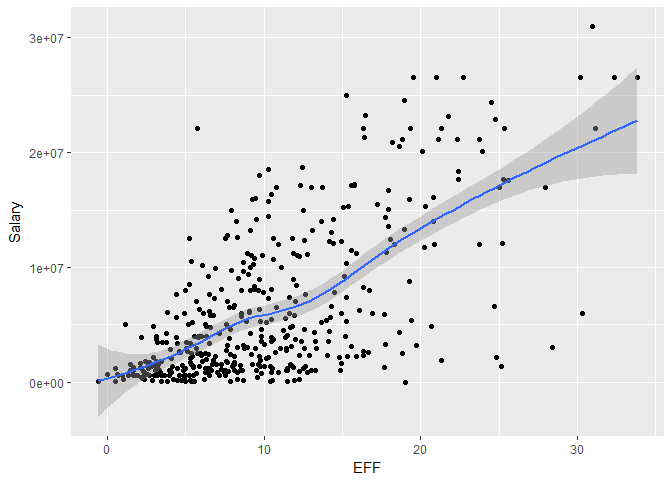
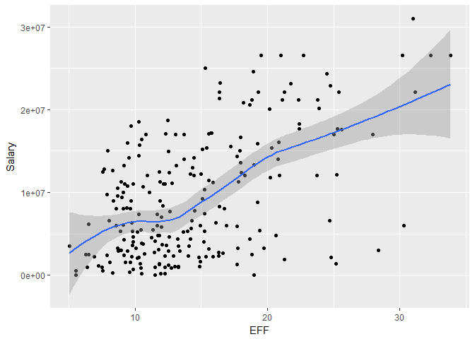

hw02-Tiantian-Fu
================

1)Create a data dictionary

2)Import the data in R

``` r
github <-"https://github.com/ucb-stat133/stat133-fall-2017/raw/master/"
file <- "data/nba2017-player-statistics.csv"
csv <- paste0(github,file)
download.file(url = csv, destfile = 'nba2017-player-statistics.csv')
```

``` r
dat <- read.csv('nba2017-player-statistics.csv',colClasses = c("character","character","factor","character","double",rep('integer',19)))
str(dat)
```

    ## 'data.frame':    441 obs. of  24 variables:
    ##  $ Player      : chr  "Al Horford" "Amir Johnson" "Avery Bradley" "Demetrius Jackson" ...
    ##  $ Team        : chr  "BOS" "BOS" "BOS" "BOS" ...
    ##  $ Position    : Factor w/ 5 levels "C","PF","PG",..: 1 2 5 3 4 3 4 5 4 2 ...
    ##  $ Experience  : chr  "9" "11" "6" "R" ...
    ##  $ Salary      : num  26540100 12000000 8269663 1450000 1410598 ...
    ##  $ Rank        : int  4 6 5 15 11 1 3 13 8 10 ...
    ##  $ Age         : int  30 29 26 22 31 27 26 21 20 29 ...
    ##  $ GP          : int  68 80 55 5 47 76 72 29 78 78 ...
    ##  $ GS          : int  68 77 55 0 0 76 72 0 20 6 ...
    ##  $ MIN         : int  2193 1608 1835 17 538 2569 2335 220 1341 1232 ...
    ##  $ FGM         : int  379 213 359 3 95 682 333 25 192 114 ...
    ##  $ FGA         : int  801 370 775 4 232 1473 720 58 423 262 ...
    ##  $ Points3     : int  86 27 108 1 39 245 157 12 46 45 ...
    ##  $ Points3_atts: int  242 66 277 1 111 646 394 35 135 130 ...
    ##  $ Points2     : int  293 186 251 2 56 437 176 13 146 69 ...
    ##  $ Points2_atts: int  559 304 498 3 121 827 326 23 288 132 ...
    ##  $ FTM         : int  108 67 68 3 33 590 176 6 85 26 ...
    ##  $ FTA         : int  135 100 93 6 41 649 217 9 124 37 ...
    ##  $ OREB        : int  95 117 65 2 17 43 48 6 45 60 ...
    ##  $ DREB        : int  369 248 269 2 68 162 367 20 175 213 ...
    ##  $ AST         : int  337 140 121 3 33 449 155 4 64 71 ...
    ##  $ STL         : int  52 52 68 0 9 70 72 10 35 26 ...
    ##  $ BLK         : int  87 62 11 0 7 13 23 2 18 17 ...
    ##  $ TO          : int  116 77 88 0 25 210 79 4 68 39 ...

``` r
dat1 <- read_csv ('nba2017-player-statistics.csv')
```

    ## Parsed with column specification:
    ## cols(
    ##   .default = col_integer(),
    ##   Player = col_character(),
    ##   Team = col_character(),
    ##   Position = col_character(),
    ##   Experience = col_character(),
    ##   Salary = col_double()
    ## )

    ## See spec(...) for full column specifications.

``` r
dat1$Position <-factor(dat1$Position)
str(dat1)
```

    ## Classes 'tbl_df', 'tbl' and 'data.frame':    441 obs. of  24 variables:
    ##  $ Player      : chr  "Al Horford" "Amir Johnson" "Avery Bradley" "Demetrius Jackson" ...
    ##  $ Team        : chr  "BOS" "BOS" "BOS" "BOS" ...
    ##  $ Position    : Factor w/ 5 levels "C","PF","PG",..: 1 2 5 3 4 3 4 5 4 2 ...
    ##  $ Experience  : chr  "9" "11" "6" "R" ...
    ##  $ Salary      : num  26540100 12000000 8269663 1450000 1410598 ...
    ##  $ Rank        : int  4 6 5 15 11 1 3 13 8 10 ...
    ##  $ Age         : int  30 29 26 22 31 27 26 21 20 29 ...
    ##  $ GP          : int  68 80 55 5 47 76 72 29 78 78 ...
    ##  $ GS          : int  68 77 55 0 0 76 72 0 20 6 ...
    ##  $ MIN         : int  2193 1608 1835 17 538 2569 2335 220 1341 1232 ...
    ##  $ FGM         : int  379 213 359 3 95 682 333 25 192 114 ...
    ##  $ FGA         : int  801 370 775 4 232 1473 720 58 423 262 ...
    ##  $ Points3     : int  86 27 108 1 39 245 157 12 46 45 ...
    ##  $ Points3_atts: int  242 66 277 1 111 646 394 35 135 130 ...
    ##  $ Points2     : int  293 186 251 2 56 437 176 13 146 69 ...
    ##  $ Points2_atts: int  559 304 498 3 121 827 326 23 288 132 ...
    ##  $ FTM         : int  108 67 68 3 33 590 176 6 85 26 ...
    ##  $ FTA         : int  135 100 93 6 41 649 217 9 124 37 ...
    ##  $ OREB        : int  95 117 65 2 17 43 48 6 45 60 ...
    ##  $ DREB        : int  369 248 269 2 68 162 367 20 175 213 ...
    ##  $ AST         : int  337 140 121 3 33 449 155 4 64 71 ...
    ##  $ STL         : int  52 52 68 0 9 70 72 10 35 26 ...
    ##  $ BLK         : int  87 62 11 0 7 13 23 2 18 17 ...
    ##  $ TO          : int  116 77 88 0 25 210 79 4 68 39 ...
    ##  - attr(*, "spec")=List of 2
    ##   ..$ cols   :List of 24
    ##   .. ..$ Player      : list()
    ##   .. .. ..- attr(*, "class")= chr  "collector_character" "collector"
    ##   .. ..$ Team        : list()
    ##   .. .. ..- attr(*, "class")= chr  "collector_character" "collector"
    ##   .. ..$ Position    : list()
    ##   .. .. ..- attr(*, "class")= chr  "collector_character" "collector"
    ##   .. ..$ Experience  : list()
    ##   .. .. ..- attr(*, "class")= chr  "collector_character" "collector"
    ##   .. ..$ Salary      : list()
    ##   .. .. ..- attr(*, "class")= chr  "collector_double" "collector"
    ##   .. ..$ Rank        : list()
    ##   .. .. ..- attr(*, "class")= chr  "collector_integer" "collector"
    ##   .. ..$ Age         : list()
    ##   .. .. ..- attr(*, "class")= chr  "collector_integer" "collector"
    ##   .. ..$ GP          : list()
    ##   .. .. ..- attr(*, "class")= chr  "collector_integer" "collector"
    ##   .. ..$ GS          : list()
    ##   .. .. ..- attr(*, "class")= chr  "collector_integer" "collector"
    ##   .. ..$ MIN         : list()
    ##   .. .. ..- attr(*, "class")= chr  "collector_integer" "collector"
    ##   .. ..$ FGM         : list()
    ##   .. .. ..- attr(*, "class")= chr  "collector_integer" "collector"
    ##   .. ..$ FGA         : list()
    ##   .. .. ..- attr(*, "class")= chr  "collector_integer" "collector"
    ##   .. ..$ Points3     : list()
    ##   .. .. ..- attr(*, "class")= chr  "collector_integer" "collector"
    ##   .. ..$ Points3_atts: list()
    ##   .. .. ..- attr(*, "class")= chr  "collector_integer" "collector"
    ##   .. ..$ Points2     : list()
    ##   .. .. ..- attr(*, "class")= chr  "collector_integer" "collector"
    ##   .. ..$ Points2_atts: list()
    ##   .. .. ..- attr(*, "class")= chr  "collector_integer" "collector"
    ##   .. ..$ FTM         : list()
    ##   .. .. ..- attr(*, "class")= chr  "collector_integer" "collector"
    ##   .. ..$ FTA         : list()
    ##   .. .. ..- attr(*, "class")= chr  "collector_integer" "collector"
    ##   .. ..$ OREB        : list()
    ##   .. .. ..- attr(*, "class")= chr  "collector_integer" "collector"
    ##   .. ..$ DREB        : list()
    ##   .. .. ..- attr(*, "class")= chr  "collector_integer" "collector"
    ##   .. ..$ AST         : list()
    ##   .. .. ..- attr(*, "class")= chr  "collector_integer" "collector"
    ##   .. ..$ STL         : list()
    ##   .. .. ..- attr(*, "class")= chr  "collector_integer" "collector"
    ##   .. ..$ BLK         : list()
    ##   .. .. ..- attr(*, "class")= chr  "collector_integer" "collector"
    ##   .. ..$ TO          : list()
    ##   .. .. ..- attr(*, "class")= chr  "collector_integer" "collector"
    ##   ..$ default: list()
    ##   .. ..- attr(*, "class")= chr  "collector_guess" "collector"
    ##   ..- attr(*, "class")= chr "col_spec"

3)Right after importing the data

``` r
dat$Experience[dat$Experience=='R']<-0
dat$Experience<-factor(dat$Experience)
dat$Experience
```

    ##   [1] 9  11 6  0  9  5  4  2  0  6  1  3  2  1  4  10 12 11 5  1  5  12 13
    ##  [24] 0  8  13 5  13 15 5  2  5  1  7  7  0  0  4  10 2  1  5  0  6  7  2 
    ##  [47] 4  7  1  0  8  8  6  9  5  3  0  0  3  0  3  12 8  11 4  12 0  14 3 
    ##  [70] 10 3  10 3  3  6  2  17 4  4  0  3  8  4  1  9  0  3  8  12 11 0  7 
    ##  [93] 1  6  6  5  11 1  6  1  9  8  1  1  1  0  13 3  1  5  2  3  2  0  10
    ## [116] 8  4  8  4  7  9  1  1  6  0  0  2  13 7  1  4  4  12 1  1  0  6  5 
    ## [139] 3  5  0  3  5  1  5  4  1  1  3  1  4  2  5  9  11 4  4  8  9  0  13
    ## [162] 0  8  7  9  3  1  4  5  0  0  0  0  9  0  2  5  9  8  2  2  4  8  7 
    ## [185] 0  1  5  0  0  4  0  0  7  1  8  0  1  2  1  3  4  0  1  6  0  4  3 
    ## [208] 8  0  0  6  2  2  2  4  10 1  2  2  6  12 0  13 4  3  2  8  9  1  5 
    ## [231] 13 0  11 7  13 0  7  11 0  0  3  9  1  5  2  10 14 7  15 15 2  0  2 
    ## [254] 8  0  7  0  11 1  4  8  1  12 0  7  4  6  11 0  11 8  0  10 16 8  8 
    ## [277] 18 11 6  5  13 1  6  8  6  3  2  15 0  1  2  3  5  1  0  3  0  2  5 
    ## [300] 2  1  4  12 5  8  0  3  7  3  0  8  5  0  2  2  1  8  9  12 3  18 0 
    ## [323] 0  15 6  3  3  4  6  6  0  2  4  4  2  1  2  0  7  7  1  2  0  12 0 
    ## [346] 5  0  3  16 1  8  4  8  6  4  1  0  7  6  4  5  4  7  6  0  3  2  0 
    ## [369] 3  12 18 0  2  4  10 0  2  0  1  3  7  0  8  9  3  0  7  6  0  8  2 
    ## [392] 0  10 0  7  7  1  2  2  8  6  3  7  1  0  1  7  5  3  1  2  0  9  1 
    ## [415] 0  0  2  2  1  12 16 9  2  4  6  2  1  3  5  0  1  0  2  6  9  13 0 
    ## [438] 11 2  0  15
    ## Levels: 0 1 10 11 12 13 14 15 16 17 18 2 3 4 5 6 7 8 9

4)Performance of players

``` r
Missed_FG = dat$FGA -dat$FGM
Missed_FT = dat$FTA -dat$FTM
PTS = dat$Points2*2+dat$Points3*3+dat$FTM*1
REB = dat$OREB + dat$DREB
MPG = (dat$MIN)/(dat$GP)
EFF =(PTS+REB+(dat$AST)+(dat$STL)+(dat$BLK)-Missed_FG-Missed_FT-(dat$TO))/(dat$GP)
EFF
```

    ##   [1] 19.5147059 10.9000000 16.3454545  2.6000000  4.8085106 24.6842105
    ##   [7] 16.0694444  2.4137931  6.5897436  6.2564103  2.1600000 11.7466667
    ##  [13] 12.3797468  6.7837838  5.0000000  9.9324324  5.0000000  8.2916667
    ##  [19]  6.2000000 19.0000000  7.8815789  7.6341463  2.8333333  3.5476190
    ##  [25] 22.3666667 10.1714286 22.3888889 30.9729730  6.2531646 15.3846154
    ##  [31]  2.1111111 10.2625000  6.9629630 22.7162162  9.5000000  3.0270270
    ##  [37]  5.1296296 17.7125000 23.7333333  9.7894737  7.4868421  9.7916667
    ##  [43]  6.5090909  9.0769231 14.9565217 10.5769231 19.3116883  6.2608696
    ##  [49]  0.5000000  1.6315789  9.2580645  7.5945946 25.0256410 18.2926829
    ##  [55] 15.2368421 17.7000000  3.1666667  4.0000000  4.4561404  3.2631579
    ##  [61] 16.3164557 21.7432432 12.0769231  4.9411765 10.3013699  6.3392857
    ##  [67]  5.3698630  6.3333333  8.6285714 20.1304348  2.1875000 10.4677419
    ##  [73] 12.2278481 28.3750000 15.5432099 19.4313725  5.3648649 10.6034483
    ##  [79] 15.0689655 12.2400000  8.6973684  9.7500000  5.3857143  3.0975610
    ##  [85]  5.8421053  4.6842105  9.1750000  4.5692308  9.3333333  9.8421053
    ##  [91]  0.6086957 19.2439024  1.4848485  6.0816327  9.8333333  6.0000000
    ##  [97]  9.4054054 18.8271605 22.3866667  3.0344828 14.4189189  3.7777778
    ## [103]  8.5156250  2.9090909  8.3030303  5.3157895 16.4333333  4.0256410
    ## [109]  6.8412698 25.6052632  5.3000000  7.6444444 11.9571429  5.6818182
    ## [115] 13.6811594 13.1111111 13.3478261 19.2465753 25.3636364 15.1710526
    ## [121]  6.5909091 10.4339623 10.7222222  4.9558824  4.2000000  7.5384615
    ## [127] 14.2465753  3.1176471  8.5483871  8.5070423 21.2962963  7.8000000
    ## [133]  7.2820513  7.6285714  2.3589744  2.6842105 11.6419753 12.2666667
    ## [139] 12.0263158 12.5949367  0.0000000  5.4516129 12.5000000  5.0519481
    ## [145] 15.7926829  3.2926829  4.7692308  4.0769231 15.2419355 11.4266667
    ## [151] 10.7741935  4.7500000 20.8987342  9.7162162 14.1842105 14.3086420
    ## [157]  5.2307692 18.1558442  6.1400000  2.3333333 18.9324324  5.2777778
    ## [163] 11.8571429 16.3750000 13.0434783  8.1341463 18.6515152 11.3797468
    ## [169]  6.4782609  3.4285714  3.9687500  5.6617647  4.9230769  3.1666667
    ## [175] 12.6250000 13.2000000 10.8148148  5.1774194  6.8205128  1.6444444
    ## [181] 16.6463415 13.6911765  7.9275362  8.0277778  3.8000000  4.4307692
    ## [187] 20.2133333 -0.6000000  2.2631579 11.0833333 11.5000000 12.9135802
    ## [193]  8.3611111 11.7000000  9.0000000 20.6451613  9.6250000  8.8625000
    ## [199] 13.2807018 14.8656716  9.1176471 10.3888889 12.7407407  5.2500000
    ## [205]  5.8405797  3.8000000  8.6666667 18.8000000  9.2807018  7.2465753
    ## [211] 15.5555556  7.5000000  8.9062500  6.5000000  7.5625000  5.7246377
    ## [217] 11.8076923 11.4857143  9.8474576 15.0985915 12.7763158  2.6000000
    ## [223]  8.1176471 20.3157895  6.4285714  3.9615385  7.9610390 30.1935484
    ## [229]  4.4905660 17.9615385  9.6000000  4.5633803  6.7763158 25.2025316
    ## [235] 11.4428571  1.8333333  9.1176471 11.6962025  4.8805970  3.1842105
    ## [241] 11.0131579  2.8421053  6.2564103 25.2972973  6.3194444 18.6527778
    ## [247]  8.2608696  9.8125000 17.2031250 10.2539683  1.6400000  5.0000000
    ## [253] 17.7076923 12.5466667  1.0000000 32.3456790  0.9285714 12.0000000
    ## [259] 11.4310345 14.9402985 12.4583333  8.1298701 14.4750000 10.5000000
    ## [265]  2.1000000  9.8648649 23.9016393  6.6923077  1.6666667 24.7704918
    ## [271] 23.7654321  0.7142857 11.6410256  9.1463415  6.8875000 10.0487805
    ## [277]  3.4800000  8.0625000  4.3823529  6.0476190  5.6986301  5.8333333
    ## [283] 12.1200000 16.7142857 20.8356164  4.8627451  9.7195122  9.2051282
    ## [289]  2.6666667  3.1000000 10.3728814 24.8024691  7.8545455  5.9859155
    ## [295]  4.8823529 10.2911392  6.4691358  5.9545455 15.7361111  6.6025641
    ## [301] 11.5000000  2.9062500  3.1500000  2.3846154 33.8395062  3.6250000
    ## [307] 15.5625000  9.6956522 14.2686567  6.3750000  8.5357143  5.7352941
    ## [313]  2.8055556  8.7343750 13.2467532  5.4761905 21.1351351 20.9855072
    ## [319] 11.3380282  5.3134328  9.1506849  3.4242424  3.4545455 15.2602740
    ## [325] 12.6065574 10.2784810 19.7500000 24.5066667  8.0869565 10.4615385
    ## [331]  1.3428571 21.3000000 11.8961039  6.4459459  7.6216216  3.3846154
    ## [337]  4.1132075  1.9375000 17.9206349  7.2439024 10.0363636 14.9122807
    ## [343]  8.6707317 11.2266667  6.2903226 14.4426230  3.0909091 14.0370370
    ## [349]  3.2000000 25.1506849  1.1666667 14.0833333 15.8873239  7.8717949
    ## [355] 31.1600000  5.5000000  7.1764706  8.9545455 27.9411765  5.2352941
    ## [361]  9.3561644 11.9473684 17.7910448  6.9032258  5.3333333  8.9125000
    ## [367] 10.1692308  2.5454545 13.0000000  7.1692308 15.2777778  5.5061728
    ## [373]  9.3636364 16.3417722 11.4857143  5.5555556 14.1818182  3.6481481
    ## [379]  7.0410959 12.5428571 12.3150685 12.2500000  8.5692308  7.5245902
    ## [385]  6.3442623 13.2800000 13.6617647  9.6461538  8.0909091 10.4647887
    ## [391]  5.4210526  3.0454545 18.9666667 10.5151515 11.8405797 10.5714286
    ## [397] 10.4533333  4.1111111 16.8902439  5.0212766  4.3709677 16.3048780
    ## [403]  2.1428571 30.3292683  5.8205128  7.7846154  4.4615385 17.9466667
    ## [409]  8.2820513  5.5000000 15.8723404  8.8860759  6.5000000 13.9523810
    ## [415]  7.8500000  9.5000000 11.8048780 17.7567568 12.5079365  9.6785714
    ## [421]  1.4800000 10.4500000  9.0895522  7.4583333  9.4259259  7.6363636
    ## [427] 10.8936170 11.8051948  8.2962963  6.5000000 15.3333333  3.7441860
    ## [433]  0.5000000 20.8030303  8.6718750  5.5223881  9.4390244  2.2142857
    ## [439] 14.8030303  7.7377049 18.0425532

``` r
summary(EFF)
```

    ##    Min. 1st Qu.  Median    Mean 3rd Qu.    Max. 
    ##  -0.600   5.452   9.090  10.137  13.247  33.840

``` r
hist(EFF)
```


``` r
#Display the player name, team, salary,and EFF value of the top-10 players by decreasing order
dat_new <- mutate(dat,EFF)
dat_new1 <- arrange(dat_new,desc(EFF))
display_A <- select(slice(dat_new1,1:10),Player,Team,Salary,EFF)
display_A
```

    ## # A tibble: 10 x 4
    ##                   Player  Team   Salary      EFF
    ##                    <chr> <chr>    <dbl>    <dbl>
    ##  1     Russell Westbrook   OKC 26540100 33.83951
    ##  2          James Harden   HOU 26540100 32.34568
    ##  3         Anthony Davis   NOP 22116750 31.16000
    ##  4          LeBron James   CLE 30963450 30.97297
    ##  5    Karl-Anthony Towns   MIN  5960160 30.32927
    ##  6          Kevin Durant   GSW 26540100 30.19355
    ##  7 Giannis Antetokounmpo   MIL  2995421 28.37500
    ##  8      DeMarcus Cousins   NOP 16957900 27.94118
    ##  9          Jimmy Butler   CHI 17552209 25.60526
    ## 10      Hassan Whiteside   MIA 22116750 25.36364

``` r
#Provide the names of the players that have a negative EFF.
select(filter(dat_new,EFF<0),Player)
```

    ##            Player
    ## 1 Patricio Garino

``` r
#Use the function cor() to compute the coreelation coefficients betweeen EFF and all the variables used in teh EFF formula.
cor_table <-data.frame(
  PTS=cor(EFF,PTS),
  REB=cor(EFF,REB),
  AST=cor(EFF,dat$AST),
  STL=cor(EFF,dat$STL),
  BLK=cor(EFF,dat$BLK),
  Missed_FG=cor(EFF,-Missed_FG),
  Missed_FT=cor(EFF,-Missed_FT),
  TO=cor(EFF,-dat$TO)
)
cor_table
```

    ##         PTS       REB       AST       STL       BLK  Missed_FG  Missed_FT
    ## 1 0.8588644 0.7634501 0.6689232 0.6957286 0.5679571 -0.7722477 -0.7271456
    ##           TO
    ## 1 -0.8003289

``` r
?sort
```

    ## starting httpd help server ... done

``` r
cor_table[1,]  = sort(cor_table[1,], decreasing = TRUE)


#Barplot it
barplot(as.numeric(cor_table),
        ylim=c(-1,1),
        main= "Correlations betwwen Players Stats and EFF",
        names.arg = variable.names(cor_table),
        col=ifelse(as.numeric(cor_table)>0,"grey","coral1"),
        border=NA,
        cex.names = 0.5)
```


5)Efficiency and Salary

``` r
#scatterplot between efficiency and salary
ggplot(data = dat_new, aes(x=EFF,y=Salary) )+
  geom_point()+
  geom_smooth(method = loess)
```



``` r
cor(dat_new$EFF,dat_new$Salary)
```

    ## [1] 0.655624

``` r
#they have kind of strong positive relationship

#MPG players
dat_new <- mutate(dat_new,MPG)
Players2 <-(filter(dat_new,MPG >= 20))
Players2
```

    ##                       Player Team Position Experience   Salary Rank Age GP
    ## 1                 Al Horford  BOS        C          9 26540100    4  30 68
    ## 2               Amir Johnson  BOS       PF         11 12000000    6  29 80
    ## 3              Avery Bradley  BOS       SG          6  8269663    5  26 55
    ## 4              Isaiah Thomas  BOS       PG          5  6587132    1  27 76
    ## 5                Jae Crowder  BOS       SF          4  6286408    3  26 72
    ## 6               Kelly Olynyk  BOS        C          3  3094014    7  25 75
    ## 7               Marcus Smart  BOS       SG          2  3578880    2  22 79
    ## 8             Deron Williams  CLE       PG         11   259626   11  32 24
    ## 9                Edy Tavares  CLE        C          1     5145   18  24  1
    ## 10             Iman Shumpert  CLE       SG          5  9700000    4  26 76
    ## 11                J.R. Smith  CLE       SG         12 12800000    8  31 41
    ## 12                Kevin Love  CLE       PF          8 21165675    5  28 60
    ## 13               Kyle Korver  CLE       SG         13  5239437    9  35 35
    ## 14              Kyrie Irving  CLE       PG          5 17638063    2  24 72
    ## 15              LeBron James  CLE       SF         13 30963450    1  32 74
    ## 16         Richard Jefferson  CLE       SF         15  2500000    6  36 79
    ## 17          Tristan Thompson  CLE        C          5 15330435    3  25 78
    ## 18               Cory Joseph  TOR       SG          5  7330000    4  25 80
    ## 19             DeMar DeRozan  TOR       SG          7 26540100    1  27 74
    ## 20           DeMarre Carroll  TOR       SF          7 14200000    5  30 72
    ## 21         Jonas Valanciunas  TOR        C          4 14382022    3  24 80
    ## 22                Kyle Lowry  TOR       PG         10 12000000    2  30 60
    ## 23               P.J. Tucker  TOR       SF          5  5300000   13  31 24
    ## 24         Patrick Patterson  TOR       PF          6  6050000    6  27 65
    ## 25               Serge Ibaka  TOR       PF          7 12250000   11  27 23
    ## 26          Bojan Bogdanovic  WAS       SF          2  3730653   10  27 26
    ## 27              Bradley Beal  WAS       SG          4 22116750    2  23 77
    ## 28                 John Wall  WAS       PG          6 16957900    1  26 78
    ## 29             Marcin Gortat  WAS        C          9 12000000    4  32 82
    ## 30           Markieff Morris  WAS       PF          5  7400000    5  27 76
    ## 31               Otto Porter  WAS       SF          3  5893981    3  23 80
    ## 32           Dennis Schroder  ATL       PG          3  2708582    1  23 79
    ## 33             Dwight Howard  ATL        C         12 23180275    3  31 74
    ## 34            Ersan Ilyasova  ATL       PF          8  8400000   12  29 26
    ## 35             Kent Bazemore  ATL       SF          4 15730338    5  27 73
    ## 36              Paul Millsap  ATL       PF         10 20072033    2  31 69
    ## 37           Thabo Sefolosha  ATL       SF         10  3850000    6  32 62
    ## 38              Tim Hardaway  ATL       SG          3  2281605    4  24 79
    ## 39     Giannis Antetokounmpo  MIL       SF          3  2995421    1  22 80
    ## 40               Greg Monroe  MIL        C          6 17100000    5  26 81
    ## 41             Jabari Parker  MIL       PF          2  5374320    6  21 51
    ## 42           Khris Middleton  MIL       SF          4 15200000   11  25 29
    ## 43           Malcolm Brogdon  MIL       SG          0   925000    4  24 75
    ## 44       Matthew Dellavedova  MIL       PG          3  9607500    3  26 76
    ## 45                Tony Snell  MIL       SG          3  2368327    2  25 80
    ## 46                C.J. Miles  IND       SF         11  4583450    6  29 76
    ## 47               Jeff Teague  IND       PG          7  8800000    2  28 82
    ## 48          Lance Stephenson  IND       SG          6  4000000   15  26  6
    ## 49               Monta Ellis  IND       SG         11 10770000    5  31 74
    ## 50              Myles Turner  IND        C          1  2463840    3  20 81
    ## 51               Paul George  IND       SF          6 18314532    1  26 75
    ## 52            Thaddeus Young  IND       PF          9 14153652    4  28 74
    ## 53               Dwyane Wade  CHI       SG         13 23200000    4  35 60
    ## 54              Jimmy Butler  CHI       SF          5 17552209    1  27 76
    ## 55            Nikola Mirotic  CHI       PF          2  5782450    5  25 70
    ## 56               Rajon Rondo  CHI       PG         10 14000000    3  30 69
    ## 57               Robin Lopez  CHI        C          8 13219250    2  28 81
    ## 58              Dion Waiters  MIA       SG          4  2898000    8  25 46
    ## 59              Goran Dragic  MIA       PG          8 15890000    2  30 73
    ## 60          Hassan Whiteside  MIA        C          4 22116750    1  27 77
    ## 61             James Johnson  MIA       PF          7  4000000    4  29 76
    ## 62           Josh Richardson  MIA       SG          1   874636    6  23 53
    ## 63           Justise Winslow  MIA       SF          1  2593440   11  20 18
    ## 64           Rodney McGruder  MIA       SG          0   543471    5  25 78
    ## 65             Tyler Johnson  MIA       PG          2  5628000    3  24 73
    ## 66           Wayne Ellington  MIA       SG          7  6000000    7  29 62
    ## 67            Andre Drummond  DET        C          4 22116750    4  23 81
    ## 68                 Ish Smith  DET       PG          6  6000000    5  28 81
    ## 69                 Jon Leuer  DET       PF          5 10991957    6  27 75
    ## 70  Kentavious Caldwell-Pope  DET       SG          3  3678319    3  23 76
    ## 71             Marcus Morris  DET       SF          5  4625000    2  27 79
    ## 72            Reggie Jackson  DET       PG          5 14956522    7  26 52
    ## 73             Tobias Harris  DET       PF          5 17200000    1  24 82
    ## 74               Cody Zeller  CHO       PF          3  5318313    7  24 62
    ## 75            Frank Kaminsky  CHO        C          1  2730000    5  23 75
    ## 76              Kemba Walker  CHO       PG          5 12000000    1  26 79
    ## 77           Marco Belinelli  CHO       SG          9  6333333    6  30 74
    ## 78           Marvin Williams  CHO       PF         11 12250000    4  30 76
    ## 79    Michael Kidd-Gilchrist  CHO       SF          4 13000000    3  23 81
    ## 80             Nicolas Batum  CHO       SG          8 20869566    2  28 77
    ## 81           Carmelo Anthony  NYK       SF         13 24559380    1  32 74
    ## 82              Courtney Lee  NYK       SG          8 11242000    2  31 77
    ## 83              Derrick Rose  NYK       PG          7 21323250    4  28 64
    ## 84               Joakim Noah  NYK        C          9 17000000   10  31 46
    ## 85        Kristaps Porzingis  NYK       PF          1  4317720    3  21 66
    ## 86              Lance Thomas  NYK       PF          5  6191000   11  28 46
    ## 87              Aaron Gordon  ORL       SF          2  4351320    2  21 80
    ## 88           Bismack Biyombo  ORL        C          5 17000000    5  24 81
    ## 89             Elfrid Payton  ORL       PG          2  2613600    1  22 82
    ## 90             Evan Fournier  ORL       SG          4 17000000    3  24 68
    ## 91                Jeff Green  ORL       PF          8 15000000    8  30 69
    ## 92               Jodie Meeks  ORL       SG          7  6540000   12  29 36
    ## 93            Nikola Vucevic  ORL        C          5 11750000    4  26 75
    ## 94             Terrence Ross  ORL       SF          4 10000000   11  25 24
    ## 95            Alex Poythress  PHI       PF          0    31969   16  23  6
    ## 96               Dario Saric  PHI       PF          0  2318280    3  22 81
    ## 97          Gerald Henderson  PHI       SG          7  9000000    5  29 72
    ## 98             Jahlil Okafor  PHI        C          1  4788840   10  21 50
    ## 99            Jerryd Bayless  PHI       PG          8  9424084   19  28  3
    ## 100              Joel Embiid  PHI        C          0  4826160   11  22 31
    ## 101          Justin Anderson  PHI       SF          1  1514160   14  23 24
    ## 102             Nik Stauskas  PHI       SG          2  2993040    1  23 80
    ## 103           Richaun Holmes  PHI        C          1  1025831    8  23 57
    ## 104         Robert Covington  PHI       SF          3  1015696    4  26 67
    ## 105         Sergio Rodriguez  PHI       PG          4  8000000    6  30 68
    ## 106           T.J. McConnell  PHI       PG          1   874636    2  24 81
    ## 107              Brook Lopez  BRK        C          8 21165675    1  28 75
    ## 108             Caris LeVert  BRK       SF          0  1562280    9  22 57
    ## 109         Isaiah Whitehead  BRK       PG          0  1074145    5  21 73
    ## 110               Jeremy Lin  BRK       PG          6 11483254   12  28 36
    ## 111               Joe Harris  BRK       SG          2   980431   11  25 52
    ## 112  Rondae Hollis-Jefferson  BRK       SF          1  1395600    2  22 78
    ## 113          Sean Kilpatrick  BRK       SG          2   980431    4  27 70
    ## 114        Spencer Dinwiddie  BRK       PG          2   726672    7  23 59
    ## 115            Trevor Booker  BRK       PF          6  9250000    3  29 71
    ## 116           Andre Iguodala  GSW       SF         12 11131368    5  33 76
    ## 117           Draymond Green  GSW       PF          4 15330435    3  26 76
    ## 118             Kevin Durant  GSW       SF          9 26540100    4  28 62
    ## 119            Klay Thompson  GSW       SG          5 16663575    1  26 78
    ## 120              Matt Barnes  GSW       SF         13   383351   14  36 20
    ## 121            Stephen Curry  GSW       PG          7 12112359    2  28 79
    ## 122              Danny Green  SAS       SG          7 10000000    3  29 68
    ## 123            Kawhi Leonard  SAS       SF          5 17638063    1  25 74
    ## 124        LaMarcus Aldridge  SAS       PF         10 20575005    2  31 72
    ## 125              Patty Mills  SAS       PG          7  3578948    4  28 80
    ## 126                Pau Gasol  SAS        C         15 15500000    5  36 64
    ## 127              Tony Parker  SAS       PG         15 14445313    6  34 63
    ## 128             Clint Capela  HOU        C          2  1296240    6  22 65
    ## 129              Eric Gordon  HOU       SG          8 12385364    3  28 75
    ## 130             James Harden  HOU       PG          7 26540100    1  27 81
    ## 131             Lou Williams  HOU       SG         11  7000000   11  30 23
    ## 132         Patrick Beverley  HOU       SG          4  6000000    5  28 67
    ## 133            Ryan Anderson  HOU       PF          8 18735364    4  28 72
    ## 134             Trevor Ariza  HOU       SF         12  7806971    2  31 80
    ## 135            Troy Williams  HOU       SF          0   150000   14  22  6
    ## 136            Austin Rivers  LAC       SG          4 11000000    5  24 74
    ## 137            Blake Griffin  LAC       PF          6 20140838    4  27 61
    ## 138               Chris Paul  LAC       PG         11 22868828    6  31 61
    ## 139           DeAndre Jordan  LAC        C          8 21165675    1  28 81
    ## 140              J.J. Redick  LAC       SG         10  7377500    2  32 78
    ## 141           Jamal Crawford  LAC       SG         16 13253012    3  36 82
    ## 142         Luc Mbah a Moute  LAC       SF          8  2203000    7  30 80
    ## 143           Raymond Felton  LAC       PG         11  1551659    8  32 80
    ## 144           Derrick Favors  UTA       PF          6 11050000   10  25 50
    ## 145              George Hill  UTA       PG          8  8000000    6  30 49
    ## 146           Gordon Hayward  UTA       SF          6 16073140    2  26 73
    ## 147               Joe Ingles  UTA       SF          2  2250000    3  29 82
    ## 148              Joe Johnson  UTA       SF         15 11000000    4  35 78
    ## 149              Rodney Hood  UTA       SG          2  1406520    5  24 59
    ## 150              Rudy Gobert  UTA        C          3  2121288    1  24 81
    ## 151             Shelvin Mack  UTA       PG          5  2433334    9  26 55
    ## 152           Andre Roberson  OKC       SF          3  2183072    3  25 79
    ## 153         Domantas Sabonis  OKC       PF          0  2440200    5  20 81
    ## 154              Enes Kanter  OKC        C          5 17145838    6  24 72
    ## 155        Russell Westbrook  OKC       PG          8 26540100    1  28 81
    ## 156             Steven Adams  OKC        C          3  3140517    2  23 80
    ## 157               Taj Gibson  OKC       PF          7  8950000   12  31 23
    ## 158           Victor Oladipo  OKC       SG          3  6552960    4  24 67
    ## 159          Andrew Harrison  MEM       PG          0   945000    8  22 72
    ## 160              James Ennis  MEM       SF          2  2898000    7  26 64
    ## 161           JaMychal Green  MEM       PF          2   980431    3  26 77
    ## 162               Marc Gasol  MEM        C          8 21165675    1  32 74
    ## 163              Mike Conley  MEM       PG          9 26540100    2  29 69
    ## 164               Tony Allen  MEM       SG         12  5505618    4  35 71
    ## 165             Vince Carter  MEM       SF         18  4264057    5  40 73
    ## 166            Zach Randolph  MEM       PF         15 10361445    6  35 73
    ## 167          Al-Farouq Aminu  POR       SF          6  7680965    5  26 61
    ## 168             Allen Crabbe  POR       SG          3 18500000    3  24 79
    ## 169            C.J. McCollum  POR       SG          3  3219579    1  25 80
    ## 170           Damian Lillard  POR       PG          4 24328425    2  26 75
    ## 171              Evan Turner  POR       SF          6 16393443    6  28 65
    ## 172             Jusuf Nurkic  POR        C          2  1921320   11  22 20
    ## 173         Maurice Harkless  POR       SF          4  8988764    4  23 77
    ## 174         Danilo Gallinari  DEN       SF          7 15050000    2  28 63
    ## 175          Emmanuel Mudiay  DEN       PG          1  3241800    8  20 55
    ## 176              Gary Harris  DEN       SG          2  1655880    5  22 57
    ## 177             Jamal Murray  DEN       SG          0  3210840    6  19 82
    ## 178            Jameer Nelson  DEN       PG         12  4540525    3  34 75
    ## 179           Kenneth Faried  DEN       PF          5 12078652    9  27 61
    ## 180            Mason Plumlee  DEN        C          3  2328530   13  26 27
    ## 181             Nikola Jokic  DEN        C          1  1358500    4  21 73
    ## 182              Will Barton  DEN       SG          4  3533333    7  26 60
    ## 183          Wilson Chandler  DEN       SF          8 11200000    1  29 71
    ## 184            Anthony Davis  NOP        C          4 22116750    1  23 75
    ## 185             Axel Toupane  NOP       SF          1    20580   23  24  2
    ## 186         Dante Cunningham  NOP       SF          7  2978250    5  29 66
    ## 187         DeMarcus Cousins  NOP        C          6 16957900   11  26 17
    ## 188            E'Twaun Moore  NOP       SG          5  8081363    4  27 73
    ## 189          Jordan Crawford  NOP       SG          4   173094   15  28 19
    ## 190             Jrue Holiday  NOP       PG          7 11286518    3  26 67
    ## 191             Solomon Hill  NOP       SF          3 11241218    2  25 80
    ## 192              Tim Frazier  NOP       PG          2  2090000    6  26 65
    ## 193          DeAndre Liggins  DAL       SG          3  1015696   23  28  1
    ## 194            Dirk Nowitzki  DAL       PF         18 25000000    5  38 54
    ## 195      Dorian Finney-Smith  DAL       PF          0   543471    4  23 81
    ## 196          Harrison Barnes  DAL       PF          4 22116750    1  24 79
    ## 197               J.J. Barea  DAL       PG         10  4096950   11  32 35
    ## 198             Nerlens Noel  DAL        C          2  4384490   15  22 22
    ## 199               Seth Curry  DAL       PG          3  2898000    3  26 70
    ## 200          Wesley Matthews  DAL       SG          7 17100000    2  30 73
    ## 201             Yogi Ferrell  DAL       PG          0   207798    9  23 36
    ## 202         Anthony Tolliver  SAC       PF          8  8000000    6  31 65
    ## 203            Arron Afflalo  SAC       SG          9 12500000    5  31 61
    ## 204              Buddy Hield  SAC       SG          0  3517200   12  23 25
    ## 205          Darren Collison  SAC       PG          7  5229454    1  29 68
    ## 206           Garrett Temple  SAC       SG          6  8000000    4  30 65
    ## 207                 Rudy Gay  SAC       SF         10 13333333   11  30 30
    ## 208                Ty Lawson  SAC       PG          7  1315448    3  29 69
    ## 209             Tyreke Evans  SAC       SF          7 10661286   17  27 14
    ## 210           Andrew Wiggins  MIN       SF          2  6006600    1  21 82
    ## 211             Brandon Rush  MIN       SG          8  3500000    9  31 47
    ## 212             Gorgui Dieng  MIN       PF          3  2348783    3  27 82
    ## 213       Karl-Anthony Towns  MIN        C          1  5960160    2  21 82
    ## 214              Ricky Rubio  MIN       PG          5 13550000    4  26 75
    ## 215              Zach LaVine  MIN       SG          2  2240880    5  21 47
    ## 216           Brandon Ingram  LAL       SF          0  5281680    2  19 79
    ## 217         D'Angelo Russell  LAL       PG          1  5332800    4  20 63
    ## 218          Jordan Clarkson  LAL       SG          2 12500000    1  24 82
    ## 219            Julius Randle  LAL       PF          2  3267120    3  22 74
    ## 220          Larry Nance Jr.  LAL       PF          1  1207680    7  24 63
    ## 221                Luol Deng  LAL       SF         12 18000000    6  31 56
    ## 222               Nick Young  LAL       SG          9  5443918    5  31 60
    ## 223           Timofey Mozgov  LAL        C          6 16000000    9  30 54
    ## 224                 Alex Len  PHO        C          3  4823621    6  23 77
    ## 225           Brandon Knight  PHO       SG          5 12606250    9  25 54
    ## 226             Devin Booker  PHO       SG          1  2223600    1  20 78
    ## 227             Eric Bledsoe  PHO       PG          6 14000000    2  27 66
    ## 228             Jared Dudley  PHO       PF          9 10470000    7  31 64
    ## 229          Marquese Chriss  PHO       PF          0  2941440    4  19 82
    ## 230              T.J. Warren  PHO       SF          2  2128920    3  23 66
    ## 231           Tyson Chandler  PHO        C         15 12415000    8  34 47
    ##     GS  MIN FGM  FGA Points3 Points3_atts Points2 Points2_atts FTM FTA
    ## 1   68 2193 379  801      86          242     293          559 108 135
    ## 2   77 1608 213  370      27           66     186          304  67 100
    ## 3   55 1835 359  775     108          277     251          498  68  93
    ## 4   76 2569 682 1473     245          646     437          827 590 649
    ## 5   72 2335 333  720     157          394     176          326 176 217
    ## 6    6 1538 260  508      68          192     192          316  90 123
    ## 7   24 2399 269  749      94          332     175          417 203 250
    ## 8    4  486  68  147      22           53      46           94  21  25
    ## 9    0   24   3    4       0            0       3            4   0   1
    ## 10  31 1937 201  489      94          261     107          228  71  90
    ## 11  35 1187 123  356      95          271      28           85  10  15
    ## 12  60 1885 370  867     145          389     225          478 257 295
    ## 13   1  859 131  269      97          200      34           69  14  15
    ## 14  72 2525 671 1420     177          441     494          979 297 328
    ## 15  74 2794 736 1344     124          342     612         1002 358 531
    ## 16  13 1614 153  343      62          186      91          157  80 108
    ## 17  78 2336 262  437       0            3     262          434 106 213
    ## 18  22 2003 299  661      48          135     251          526  94 122
    ## 19  74 2620 721 1545      33          124     688         1421 545 647
    ## 20  72 1882 220  549     109          320     111          229  89 117
    ## 21  80 2066 391  702       1            2     390          700 176 217
    ## 22  60 2244 426  918     193          468     233          450 299 365
    ## 23   4  609  52  128      24           60      28           68  11  16
    ## 24   8 1599 154  384      94          253      60          131  43  60
    ## 25  23  712 128  279      41          103      87          176  30  34
    ## 26   0  601 107  234      45          115      62          119  71  76
    ## 27  77 2684 637 1322     223          552     414          770 282 342
    ## 28  78 2836 647 1435      89          272     558         1163 422 527
    ## 29  82 2556 390  674       0            2     390          672 103 159
    ## 30  76 2374 406  889      71          196     335          693 180 215
    ## 31  80 2605 414  803     148          341     266          462  99 119
    ## 32  78 2485 548 1215     100          294     448          921 218 255
    ## 33  74 2199 388  613       0            2     388          611 226 424
    ## 34  12  633  93  226      32           92      61          134  52  65
    ## 35  64 1963 295  721      92          266     203          455 119 168
    ## 36  67 2343 430  972      75          241     355          731 311 405
    ## 37  42 1596 174  395      41          120     133          275  55  75
    ## 38  30 2154 415  912     149          417     266          495 164 214
    ## 39  80 2845 656 1259      49          180     607         1079 471 612
    ## 40   0 1823 387  726       0            4     387          722 177 239
    ## 41  50 1728 399  814      65          178     334          636 162 218
    ## 42  23  889 150  333      45          104     105          229  81  92
    ## 43  28 1982 290  635      78          193     212          442 109 126
    ## 44  54 1986 208  534      79          215     129          319  82  96
    ## 45  80 2336 246  541     144          355     102          186  47  58
    ## 46  29 1776 281  647     169          409     112          238  84  93
    ## 47  82 2657 402  909      90          252     312          657 360 415
    ## 48   0  132  18   44       5            8      13           36   2   3
    ## 49  33 1998 247  557      43          135     204          422  93 128
    ## 50  81 2541 444  869      40          115     404          754 245 303
    ## 51  75 2689 622 1349     195          496     427          853 336 374
    ## 52  74 2237 362  687      45          118     317          569  45  86
    ## 53  59 1792 414  955      45          145     369          810 223 281
    ## 54  75 2809 570 1252      91          248     479         1004 585 676
    ## 55  15 1679 258  625     129          377     129          248  99 128
    ## 56  42 1843 229  561      50          133     179          428  30  50
    ## 57  81 2271 382  775       0            2     382          773  75 104
    ## 58  43 1384 281  663      85          215     196          448  82 127
    ## 59  73 2459 534 1124     117          289     417          835 298 377
    ## 60  77 2513 542  973       0            0     542          973 225 358
    ## 61   5 2085 368  769      87          256     281          513 152 215
    ## 62  34 1614 202  513      75          227     127          286  60  77
    ## 63  15  625  80  225       7           35      73          190  29  47
    ## 64  65 1966 190  460      73          220     117          240  44  71
    ## 65   0 2178 357  824      93          250     264          574 195 254
    ## 66  13 1500 231  555     149          394      82          161  37  43
    ## 67  81 2409 483  911       2            7     481          904 137 355
    ## 68  32 1955 329  749      28          105     301          644  72 102
    ## 69  34 1944 310  646      49          167     261          479  98 113
    ## 70  75 2529 370  928     153          437     217          491 154 185
    ## 71  79 2565 421 1007     118          357     303          650 145 185
    ## 72  50 1424 284  677      66          184     218          493 118 136
    ## 73  48 2567 511 1063     109          314     402          749 190 226
    ## 74  58 1725 253  443       0            1     253          442 133 196
    ## 75  16 1954 320  802     116          354     204          448 118 156
    ## 76  79 2739 643 1449     240          602     403          847 304 359
    ## 77   0 1778 264  615     102          283     162          332 150 168
    ## 78  76 2295 297  704     124          354     173          350 131 150
    ## 79  81 2349 295  618       1            9     294          609 152 194
    ## 80  77 2617 393  975     135          405     258          570 243 284
    ## 81  74 2538 602 1389     151          421     451          968 304 365
    ## 82  74 2459 321  704     108          269     213          435  85  98
    ## 83  64 2082 460  977      13           60     447          917 221 253
    ## 84  46 1015  99  201       0            1      99          200  34  78
    ## 85  65 2164 443  985     112          314     331          671 198 252
    ## 86  15  968  97  244      38           85      59          159  43  51
    ## 87  72 2298 393  865      77          267     316          598 156 217
    ## 88  27 1793 179  339       0            0     179          339 125 234
    ## 89  58 2412 430  912      40          146     390          766 146 211
    ## 90  66 2234 408  930     128          360     280          570 223 277
    ## 91  11 1534 220  558      53          193     167          365 145 168
    ## 92  10  738 103  256      56          137      47          119  65  74
    ## 93  55 2163 483 1031      23           75     460          956 107 160
    ## 94  24  748 115  267      46          135      69          132  23  27
    ## 95   1  157  25   54       6           19      19           35   8  10
    ## 96  36 2129 381  927     106          341     275          586 172 220
    ## 97  41 1667 234  553      61          173     173          380 133 165
    ## 98  33 1134 242  471       0            0     242          471 106 158
    ## 99   1   71  11   32       2            5       9           27   9  10
    ## 100 31  786 200  429      36           98     164          331 191 244
    ## 101  8  518  75  162      21           72      54           90  32  41
    ## 102 27 2188 251  634     132          359     119          275 122 150
    ## 103 17 1193 230  412      27           77     203          335  72 103
    ## 104 67 2119 292  732     137          412     155          320 143 174
    ## 105 30 1518 210  536      92          252     118          284  18  27
    ## 106 51 2133 236  512      11           55     225          457  73  90
    ## 107 75 2222 555 1172     134          387     421          785 295 364
    ## 108 26 1237 171  380      59          184     112          196  67  93
    ## 109 26 1643 204  508      44          149     160          359  91 113
    ## 110 33  883 175  400      58          156     117          244 115 141
    ## 111 11 1138 154  362      85          221      69          141  35  49
    ## 112 50 1761 235  542      15           67     220          475 190 253
    ## 113 24 1754 305  735     105          308     200          427 204 242
    ## 114 18 1334 134  302      38          101      96          201 126 159
    ## 115 43 1754 305  591      25           78     280          513  74 110
    ## 116  0 1998 219  415      64          177     155          238  72 102
    ## 117 76 2471 272  650      81          263     191          387 151 213
    ## 118 62 2070 551 1026     117          312     434          714 336 384
    ## 119 78 2649 644 1376     268          647     376          729 186 218
    ## 120  5  410  38   90      18           52      20           38  20  23
    ## 121 79 2638 675 1443     324          789     351          654 325 362
    ## 122 68 1807 176  449     118          311      58          138  27  32
    ## 123 74 2474 636 1311     147          386     489          925 469 533
    ## 124 72 2335 500 1049      23           56     477          993 220 271
    ## 125  8 1754 273  622     147          356     126          266  66  80
    ## 126 39 1627 303  604      56          104     247          500 130 184
    ## 127 63 1587 265  569      23           69     242          500  85 117
    ## 128 59 1551 362  563       0            0     362          563  94 177
    ## 129 15 2323 412 1016     246          661     166          355 147 175
    ## 130 81 2947 674 1533     262          756     412          777 746 881
    ## 131  0  591 102  264      41          129      61          135  98 113
    ## 132 67 2058 228  543     110          288     118          255  73  95
    ## 133 72 2116 323  773     204          506     119          267 129 150
    ## 134 80 2773 326  798     191          555     135          243  93 126
    ## 135  3  139  22   44       8           21      14           23   6   7
    ## 136 29 2054 323  731     111          299     212          432 132 191
    ## 137 61 2076 479  971      38          113     441          858 320 421
    ## 138 61 1921 374  785     124          302     250          483 232 260
    ## 139 81 2570 412  577       0            2     412          575 205 425
    ## 140 78 2198 396  890     201          468     195          422 180 202
    ## 141  1 2157 359  869     116          322     243          547 174 203
    ## 142 76 1787 191  378      43          110     148          268  59  87
    ## 143 11 1700 221  514      46          144     175          370  50  64
    ## 144 39 1186 203  417       3           10     200          407  67 109
    ## 145 49 1544 289  606      94          233     195          373 157 196
    ## 146 73 2516 545 1156     149          374     396          782 362 429
    ## 147 26 1972 204  451     123          279      81          172  50  68
    ## 148 14 1843 273  626     106          258     167          368  63  77
    ## 149 55 1593 272  666     114          306     158          360  90 115
    ## 150 81 2744 413  623       0            1     413          622 311 476
    ## 151  9 1205 170  381      37          120     133          261  53  77
    ## 152 79 2376 215  463      45          184     170          279  47 111
    ## 153 66 1632 192  481      51          159     141          322  44  67
    ## 154  0 1533 402  737       5           38     397          699 224 285
    ## 155 81 2802 824 1941     200          583     624         1358 710 840
    ## 156 80 2389 374  655       0            1     374          654 157 257
    ## 157 16  487  89  179       1            1      88          178  28  39
    ## 158 67 2222 412  932     127          352     285          580 116 154
    ## 159 18 1474 117  360      43          156      74          204 148 194
    ## 160 28 1501 146  321      51          137      95          184  86 110
    ## 161 75 2101 250  500      55          145     195          355 134 167
    ## 162 74 2531 532 1160     104          268     428          892 278 332
    ## 163 68 2292 464 1009     171          419     293          590 316 368
    ## 164 66 1914 274  595      15           54     259          541  80 130
    ## 165 15 1799 193  490     112          296      81          194  88 115
    ## 166  5 1786 433  964      21           94     412          870 141 193
    ## 167 25 1773 183  466      70          212     113          254  96 136
    ## 168  7 2254 303  647     134          302     169          345 105 124
    ## 169 80 2796 692 1441     185          440     507         1001 268 294
    ## 170 75 2694 661 1488     214          578     447          910 488 545
    ## 171 12 1658 235  552      31          118     204          434  85 103
    ## 172 19  584 120  236       0            1     120          235  64  97
    ## 173 69 2223 314  624      68          194     246          430  77 124
    ## 174 63 2134 335  750     126          325     209          425 349 387
    ## 175 41 1406 208  551      56          177     152          374 131 167
    ## 176 56 1782 320  636     107          255     213          381 104 134
    ## 177 10 1764 295  729     115          344     180          385 106 120
    ## 178 39 2045 268  604     106          273     162          331  45  63
    ## 179 34 1296 228  415       0            6     228          409 131 189
    ## 180 10  632  99  181       0            1      99          180  47  76
    ## 181 59 2038 494  856      45          139     449          717 188 228
    ## 182 19 1705 295  667      87          235     208          432 143 190
    ## 183 33 2197 433  940     110          326     323          614 141 194
    ## 184 75 2708 770 1527      40          134     730         1393 519 647
    ## 185  0   41   5    8       1            3       4            5   0   0
    ## 186 35 1649 174  359      71          181     103          178  16  27
    ## 187 17  574 142  314      36           96     106          218  94 121
    ## 188 22 1820 283  619      77          208     206          411  57  74
    ## 189  0  442 105  218      37           95      68          123  20  26
    ## 190 61 2190 405  894     100          281     305          613 119 168
    ## 191 71 2374 183  477      94          270      89          207 103 128
    ## 192 35 1525 163  404      40          128     123          276  98 129
    ## 193  0   25   3    6       0            1       3            5   2   3
    ## 194 54 1424 296  678      79          209     217          469  98 112
    ## 195 35 1642 124  333      56          191      68          142  46  61
    ## 196 79 2803 599 1280      78          222     521         1058 242 281
    ## 197  6  771 142  343      53          148      89          195  44  51
    ## 198 12  483  77  134       0            0      77          134  34  48
    ## 199 42 2029 338  703     137          322     201          381  85 100
    ## 200 73 2495 333  847     174          479     159          368 146 179
    ## 201 29 1046 142  345      60          149      82          196  64  73
    ## 202  9 1477 155  351      90          230      65          121  61  82
    ## 203 45 1580 185  420      62          151     123          269  83  93
    ## 204 18  727 142  296      59          138      83          158  35  43
    ## 205 64 2063 340  714      73          175     267          539 147 171
    ## 206 21 1728 183  432      82          220     101          212  58  74
    ## 207 30 1013 201  442      42          113     159          329 118 138
    ## 208 24 1732 237  522      34          118     203          404 173 217
    ## 209  6  314  59  143      21           48      38           95  24  34
    ## 210 82 3048 709 1570     103          289     606         1281 412 542
    ## 211 33 1030  70  187      44          114      26           73  13  18
    ## 212 82 2653 332  661      16           43     316          618 136 167
    ## 213 82 3030 802 1479     101          275     701         1204 356 428
    ## 214 75 2469 261  650      60          196     201          454 254 285
    ## 215 47 1749 326  710     120          310     206          400 117 140
    ## 216 40 2279 276  686      55          187     221          499 133 214
    ## 217 60 1811 351  867     135          384     216          483 147 188
    ## 218 19 2397 477 1071     117          356     360          715 134 168
    ## 219 73 2132 377  773      17           63     360          710 204 282
    ## 220  7 1442 190  361      10           36     180          325  59  80
    ## 221 49 1486 164  424      51          165     113          259  46  63
    ## 222 60 1556 272  633     170          421     102          212  77  90
    ## 223 52 1104 169  328       0            1     169          327  63  78
    ## 224 34 1560 230  463       3           12     227          451 150 208
    ## 225  5 1140 209  525      45          139     164          386 132 154
    ## 226 78 2730 606 1431     147          405     459         1026 367 441
    ## 227 66 2176 449 1034     104          310     345          724 388 458
    ## 228  7 1362 157  346      77          203      80          143  43  65
    ## 229 75 1743 284  632      72          224     212          408 113 181
    ## 230 59 2048 403  814      26           98     377          716 119 154
    ## 231 46 1298 153  228       0            0     153          228  91 124
    ##     OREB DREB AST STL BLK  TO       EFF      MPG
    ## 1     95  369 337  52  87 116 19.514706 32.25000
    ## 2    117  248 140  52  62  77 10.900000 20.10000
    ## 3     65  269 121  68  11  88 16.345455 33.36364
    ## 4     43  162 449  70  13 210 24.684211 33.80263
    ## 5     48  367 155  72  23  79 16.069444 32.43056
    ## 6     72  288 148  43  29  96 11.746667 20.50667
    ## 7     78  228 364 125  34 159 12.379747 30.36709
    ## 8      1   44  86   6   6  40  8.291667 20.25000
    ## 9      4    6   1   0   6   2 19.000000 24.00000
    ## 10    39  180 109  62  27  78  7.881579 25.48684
    ## 11    17   96  62  40  11  26  7.634146 28.95122
    ## 12   148  518 116  53  22 122 22.366667 31.41667
    ## 13     7   90  35  11   8  29 10.171429 24.54286
    ## 14    52  178 418  83  25 180 22.388889 35.06944
    ## 15    97  543 646  92  44 303 30.972973 37.75676
    ## 16    28  174  78  26  10  52  6.253165 20.43038
    ## 17   287  429  77  39  84  64 15.384615 29.94872
    ## 18    52  184 265  66  13 109 10.262500 25.03750
    ## 19    70  316 290  78  13 180 22.716216 35.40541
    ## 20    63  212  74  81  27  54  9.500000 26.13889
    ## 21   226  533  57  37  63 106 17.712500 25.82500
    ## 22    48  239 417  88  19 173 23.733333 37.40000
    ## 23    23  106  26  31   5  14  9.791667 25.37500
    ## 24    62  229  76  40  23  38  9.076923 24.60000
    ## 25    29  127  15   7  33  39 14.956522 30.95652
    ## 26    14   66  21  10   4  38 10.576923 23.11538
    ## 27    53  186 267  83  21 157 19.311688 34.85714
    ## 28    58  268 831 157  49 323 25.025641 36.35897
    ## 29   238  611 121  40  65 118 18.292683 31.17073
    ## 30   107  385 126  82  42 129 15.236842 31.23684
    ## 31   118  397 121 116  41  43 17.700000 32.56250
    ## 32    42  206 499  74  16 258 16.316456 31.45570
    ## 33   296  644 104  64  92 170 21.743243 29.71622
    ## 34    42  109  43  22   8  34 12.076923 24.34615
    ## 35    45  186 177  91  52 125 10.301370 26.89041
    ## 36   111  422 252  90  62 158 20.130435 33.95652
    ## 37    54  216 107  96  31  58 10.467742 25.74194
    ## 38    35  189 182  55  15 106 12.227848 27.26582
    ## 39   142  558 434 131 151 234 28.375000 35.56250
    ## 40   167  365 187  92  38 140 15.543210 22.50617
    ## 41    79  235 142  51  22  92 19.431373 33.88235
    ## 42    11  112  99  41   7  65 15.068966 30.65517
    ## 43    47  166 317  84  12 113 12.240000 26.42667
    ## 44    24  123 357  53   0 133  8.697368 26.13158
    ## 45    22  226  96  54  14  55  9.175000 29.20000
    ## 46    30  199  48  46  25  40  9.842105 23.36842
    ## 47    33  298 639 100  32 216 19.243902 32.40244
    ## 48     1   23  25   3   2  11  9.833333 22.00000
    ## 49    19  185 236  79  27 135  9.405405 27.00000
    ## 50   139  448 106  74 173 105 18.827160 31.37037
    ## 51    58  434 251 117  27 218 22.386667 35.85333
    ## 52   131  318 122 114  30  96 14.418919 30.22973
    ## 53    64  207 229  86  41 138 16.433333 29.86667
    ## 54   128  342 417 143  32 159 25.605263 36.96053
    ## 55    61  323  75  53  56  79 11.957143 23.98571
    ## 56    73  282 461  99  11 168 13.681159 26.71014
    ## 57   244  276  80  18 117  90 13.111111 28.03704
    ## 58    18  136 200  41  20 103 13.347826 30.08696
    ## 59    61  217 423  89  13 212 19.246575 33.68493
    ## 60   293  795  57  56 161 154 25.363636 32.63636
    ## 61    66  309 276  76  86 171 15.171053 27.43421
    ## 62    35  133 140  60  39  65 10.433962 30.45283
    ## 63    23   71  66  27   6  33 10.722222 34.72222
    ## 64    95  162 124  45  18  56  7.538462 25.20513
    ## 65    50  243 233  84  44  90 14.246575 29.83562
    ## 66    18  115  70  35   4  30  8.548387 24.19355
    ## 67   345  771  89 124  89 152 21.296296 29.74074
    ## 68    21  214 418  61  33 112 11.641975 24.13580
    ## 69   102  300 111  31  26  66 12.266667 25.92000
    ## 70    55  193 193  89  12  86 12.026316 33.27632
    ## 71    77  289 160  52  25  87 12.594937 32.46835
    ## 72    21   92 270  35   5 114 12.500000 27.38462
    ## 73    63  353 142  60  39  95 15.792683 31.30488
    ## 74   135  270  99  62  58  65 15.241935 27.82258
    ## 75    57  279 162  47  34  76 11.426667 26.05333
    ## 76    45  263 435  85  22 168 20.898734 34.67089
    ## 77    14  164 147  44   9  70  9.716216 24.02703
    ## 78    89  409 106  58  53  60 14.184211 30.19737
    ## 79   156  409 114  81  77  56 14.308642 29.00000
    ## 80    46  435 455  86  29 194 18.155844 33.98701
    ## 81    62  374 213  60  34 153 18.932432 34.29730
    ## 82    53  207 179  81  23  69 11.857143 31.93506
    ## 83    66  180 283  44  17 147 16.375000 32.53125
    ## 84   161  241 103  30  37  58 13.043478 22.06522
    ## 85   111  364  97  47 130 118 18.651515 32.78788
    ## 86    32  110  35  21   5  25  6.478261 21.04348
    ## 87   116  289 150  64  40  89 13.200000 28.72500
    ## 88   157  410  74  25  91  95 10.814815 22.13580
    ## 89    89  298 529  88  40 178 16.646341 29.41463
    ## 90    44  165 202  66   4 141 13.691176 32.85294
    ## 91    39  175  81  37  13  75  7.927536 22.23188
    ## 92     5   72  45  34   4  36  8.027778 20.50000
    ## 93   176  603 208  77  74 117 20.213333 28.84000
    ## 94     4   64  43  34  13  35 11.083333 31.16667
    ## 95    11   18   5   3   2   3 11.500000 26.16667
    ## 96   112  402 182  57  30 183 12.913580 26.28395
    ## 97    34  151 112  41  15  62  8.361111 23.15278
    ## 98    81  159  58  20  49  91 11.700000 22.68000
    ## 99     3    9  13   0   0   9  9.000000 23.66667
    ## 100   61  182  66  27  76 117 20.645161 25.35484
    ## 101   30   66  34  13   7  26  9.625000 21.58333
    ## 102   21  205 188  46  32 128  8.862500 27.35000
    ## 103   94  217  58  42  55  55 13.280702 20.92982
    ## 104   92  344 102 127  69 131 14.865672 31.62687
    ## 105   21  136 344  48   4 128  9.117647 22.32353
    ## 106   39  212 534 133  10 159 12.740741 26.33333
    ## 107  121  282 176  38 124 184 18.800000 29.62667
    ## 108   23  165 110  49   8  59  9.280702 21.70175
    ## 109   32  152 192  42  36 142  7.246575 22.50685
    ## 110   11  124 184  41  14  86 15.555556 24.52778
    ## 111   16  131  54  30   8  55  7.500000 21.88462
    ## 112   96  356 154  82  44 116 11.807692 22.57692
    ## 113   22  258 157  46   6 136 11.485714 25.05714
    ## 114   27  137 185  44  23  66  9.847458 22.61017
    ## 115  142  428 138  76  28 127 15.098592 24.70423
    ## 116   51  253 262  76  39  58 12.776316 26.28947
    ## 117   98  501 533 154 106 184 20.315789 32.51316
    ## 118   39  474 300  66  99 138 30.193548 33.38710
    ## 119   49  236 160  66  40 128 17.961538 33.96154
    ## 120   15   76  45  12   9  24  9.600000 20.50000
    ## 121   61  292 523 143  17 239 25.202532 33.39241
    ## 122   31  193 124  71  58  76  9.117647 26.57353
    ## 123   80  350 260 132  55 154 25.297297 33.43243
    ## 124  174  350 139  46  89  98 18.652778 32.43056
    ## 125   24  118 280  65   3 101  9.812500 21.92500
    ## 126  107  394 150  24  70  81 17.203125 25.42188
    ## 127    9  104 285  33   2  89 10.253968 25.19048
    ## 128  178  348  64  34  80  87 17.707692 23.86154
    ## 129   29  172 188  48  40 121 12.546667 30.97333
    ## 130   95  564 906 120  37 464 32.345679 36.38272
    ## 131   12   58  56  15   9  40 12.000000 25.69565
    ## 132   95  299 281  99  25 100 14.940299 30.71642
    ## 133  112  218  68  32  14  55 12.458333 29.38889
    ## 134   54  405 175 147  20  74 14.475000 34.66250
    ## 135    9   15   6   3   1   6 10.500000 23.16667
    ## 136   20  141 204  48  10 115  9.864865 27.75676
    ## 137  111  385 300  58  23 142 23.901639 34.03279
    ## 138   41  263 563 118   8 147 24.770492 31.49180
    ## 139  297  817  96  52 135 116 23.765432 31.72840
    ## 140   11  160 110  55  13  98 11.641026 28.17949
    ## 141   17  112 213  59  14 134  9.146341 26.30488
    ## 142   47  127  39  81  35  47  6.887500 22.33750
    ## 143   33  184 191  67  22  83  8.062500 21.25000
    ## 144   92  213  56  45  40  60 12.120000 23.72000
    ## 145   23  144 203  50  11  85 16.714286 31.51020
    ## 146   49  344 252  73  20 140 20.835616 34.46575
    ## 147   23  237 224  96   8 107  9.719512 24.04878
    ## 148   33  209 144  35  18  69  9.205128 23.62821
    ## 149   16  186  96  39  11  65 10.372881 27.00000
    ## 150  314  721  97  49 214 148 24.802469 33.87654
    ## 151   20  108 154  42   3  90  7.854545 21.90909
    ## 152   98  304  79  94  79  51 10.291139 30.07595
    ## 153   45  242  82  39  32  83  6.469136 20.14815
    ## 154  195  287  67  32  38 123 15.736111 21.29167
    ## 155  137  727 840 133  31 438 33.839506 34.59259
    ## 156  282  333  86  88  78 146 15.562500 29.86250
    ## 157   38   65  13  14  15  28  9.695652 21.17391
    ## 158   39  252 176  78  21 119 14.268657 33.16418
    ## 159   23  113 198  54  20  85  6.375000 20.47222
    ## 160   69  190  64  46  19  59  8.734375 23.45312
    ## 161  167  377  84  46  34  94 13.246753 27.28571
    ## 162   60  402 338  67  99 166 21.135135 34.20270
    ## 163   31  211 433  92  19 156 20.985507 33.21739
    ## 164  166  225  98 115  29 100 11.338028 26.95775
    ## 165   36  191 133  60  36  50  9.150685 24.64384
    ## 166  182  416 122  38  10  99 15.260274 24.46575
    ## 167   77  374  99  60  44  94 12.606557 29.06557
    ## 168   19  206  93  54  20  62 10.278481 28.53165
    ## 169   60  231 285  72  42 172 19.750000 34.95000
    ## 170   46  322 439  68  20 197 24.506667 35.92000
    ## 171   36  211 205  53  24 100 10.461538 25.50769
    ## 172   65  142  63  25  38  62 21.300000 29.20000
    ## 173  125  216  89  85  70  85 11.896104 28.87013
    ## 174   39  287 136  41  15  81 17.920635 33.87302
    ## 175   30  150 217  41  13 123 10.036364 25.56364
    ## 176   48  130 164  71   8  76 14.912281 31.26316
    ## 177   41  173 170  53  24 113  8.670732 21.51220
    ## 178   28  164 385  53   8 129 11.226667 27.26667
    ## 179  180  279  55  43  40  58 14.442623 21.24590
    ## 180   50  123  70  19  29  46 14.037037 23.40741
    ## 181  212  503 358  60  55 171 25.150685 27.91781
    ## 182   58  201 206  48  28  97 14.083333 28.41667
    ## 183  104  356 143  52  30 114 15.887324 30.94366
    ## 184  174  712 157  94 167 181 31.160000 36.10667
    ## 185    0    1   0   1   1   0  5.500000 20.50000
    ## 186   56  221  36  39  28  28  8.954545 24.98485
    ## 187   38  174  66  25  19  62 27.941176 33.76471
    ## 188   33  119 164  50  32  62  9.356164 24.93151
    ## 189    4   30  57  11   2  25 11.947368 23.26316
    ## 190   46  218 488 100  43 194 17.791045 32.68657
    ## 191   51  256 141  71  32  82  8.912500 29.67500
    ## 192   34  139 335  56   6 101 10.169231 23.46154
    ## 193    3    4   0   2   0   0 13.000000 25.00000
    ## 194   23  330  82  30  38  51 15.277778 26.37037
    ## 195   55  166  67  52  25  45  5.506173 20.27160
    ## 196   94  303 117  66  15 102 16.341772 35.48101
    ## 197    9   75 193  14   1  63 11.485714 22.02857
    ## 198   47  103  20  22  25  22 14.181818 21.95455
    ## 199   25  153 188  79   7  92 12.542857 28.98571
    ## 200   18  241 210  77  16 102 12.315068 34.17808
    ## 201   16   83 155  40   7  56 12.250000 29.05556
    ## 202   51  188  77  33  20  56  8.569231 22.72308
    ## 203    9  116  78  21   7  42  7.524590 25.90164
    ## 204   16   87  44  20   2  53 13.280000 29.08000
    ## 205   23  130 312  67   9 114 13.661765 30.33824
    ## 206   32  151 169  84  28  78  9.646154 26.58462
    ## 207   35  155  82  44  26  74 18.966667 33.76667
    ## 208   44  135 335  74   6 129 11.840580 25.10145
    ## 209    7   44  33  12   5  22 10.571429 22.42857
    ## 210  103  226 189  82  30 187 16.890244 37.17073
    ## 211   16   83  45  22  23  28  5.021277 21.91489
    ## 212  188  459 158  88  95 107 16.304878 32.35366
    ## 213  296  711 220  57 103 212 30.329268 36.95122
    ## 214   68  237 682 128  10 195 17.946667 32.92000
    ## 215   18  141 139  41  10  85 15.872340 37.21277
    ## 216   60  257 166  50  36 116  8.886076 28.84810
    ## 217   31  191 303  87  16 176 13.952381 28.74603
    ## 218   49  197 213  88   8 164 11.804878 29.23171
    ## 219  151  485 264  49  37 173 17.756757 28.81081
    ## 220  120  249  96  82  40  56 12.507937 22.88889
    ## 221   63  232  74  48  20  43  9.678571 26.53571
    ## 222   25  112  58  37  14  36 10.450000 25.93333
    ## 223  104  160  43  16  31  72  9.425926 20.44444
    ## 224  156  354  44  37  98 102 11.805195 20.25974
    ## 225   25   93 130  27   5  89  8.296296 21.11111
    ## 226   46  203 268  72  21 241 15.333333 35.00000
    ## 227   52  268 418  92  31 223 20.803030 32.96970
    ## 228   31  194 121  42  16  72  8.671875 21.28125
    ## 229   96  252  60  67  70 108  9.439024 21.25610
    ## 230  125  214  75  76  39  57 14.803030 31.03030
    ## 231  154  385  30  33  24  67 18.042553 27.61702

``` r
ggplot(data = Players2, aes(x=EFF,y=Salary) )+
  geom_point()+
  geom_smooth(method = loess)
```



``` r
cor(Players2$EFF,Players2$Salary)
```

    ## [1] 0.5367224

``` r
#it has less strong positive relationship between more established players.
```

6)Comments and Reflections 1.I think finding the correlations between EFF and other different variables is the hardest. 2.reading tables by using basis 3.yes, I got help from GSI 4.I spent 5 hours doing this HW 5.reading data and find the correlations 6.still confused about reading data 7.the fourth question 8.The last part.
