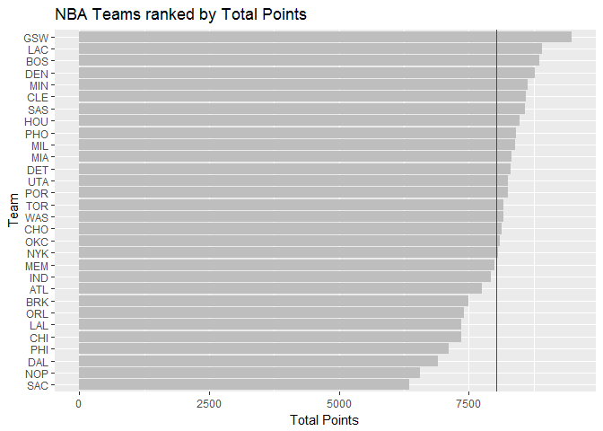

hw03-Tiantian-Fu.Rmd
================

Ranking of Teams

``` r
library(readr)
```

    ## Warning: package 'readr' was built under R version 3.4.2

``` r
library(ggplot2)
```

    ## Warning: package 'ggplot2' was built under R version 3.4.2

``` r
library(dplyr)
```

    ## Warning: package 'dplyr' was built under R version 3.4.2

    ## 
    ## Attaching package: 'dplyr'

    ## The following objects are masked from 'package:stats':
    ## 
    ##     filter, lag

    ## The following objects are masked from 'package:base':
    ## 
    ##     intersect, setdiff, setequal, union

``` r
teams <-read.csv('../data/nba2017-teams.csv')

#NBA teams ranked by total salary

  ggplot(data=teams,aes(x=reorder(team,sum_salary),y=sum_salary))+
  geom_bar(stat="identity",fill="grey")+
  coord_flip()+
  labs(x="Team",y="Salary(in millions)")+
  geom_hline(aes(yintercept = mean(sum_salary)),col="red")+
  ggtitle("NBA Teams ranked by Total Salary")
```


``` r
#NBA Teams ranked by Total Points
teams2 <-arrange(teams,desc(sum_points))
ggplot(data=teams2,aes(x=reorder(team,sum_points),y=sum_points))+
  geom_bar(stat="identity",fill="grey")+
  coord_flip()+
  labs(x="Team",y="Total Points")+
  geom_hline(aes(yintercept = mean(sum_points)),col="red")+
  ggtitle("NBA Teams ranked by Total Points")
```



``` r
#NBA Teams ranked by Total Efficiency
teams3 <-arrange(teams,desc(sum_eff))
ggplot(data=teams3,aes(x=reorder(team,sum_eff),y=sum_eff))+
  geom_bar(stat="identity",fill="grey")+
  coord_flip()+
  labs(x="Team",y="Total Efficiency")+
  geom_hline(aes(yintercept = mean(sum_eff)),col="red")+
  ggtitle("NBA Teams ranked by Total Efficiency")
```

 Principal Components Analysis (PCA)

``` r
#Calculate PCA of the teams
teams_pca <-prcomp(select(teams,sum_points3,sum_points2,sum_ft,sum_off,sum_def,sum_assist,sum_steals,sum_blocks,sum_turn,sum_fouls),scale.= TRUE)
teams_pca
```

    ## Standard deviations (1, .., p=10):
    ##  [1] 2.1669994 1.3046111 0.9897094 0.8784756 0.7308134 0.6913872 0.6182263
    ##  [8] 0.5101592 0.3655034 0.2503921
    ## 
    ## Rotation (n x k) = (10 x 10):
    ##                   PC1         PC2         PC3          PC4         PC5
    ## sum_points3 0.1121782 -0.65652993  0.28806873 -0.042637313  0.28657624
    ## sum_points2 0.3601766  0.32892544 -0.06763180 -0.347710703 -0.15173866
    ## sum_ft      0.3227564 -0.17651228  0.39157491  0.147596178 -0.21363792
    ## sum_off     0.3029366  0.35931603  0.33884845 -0.288483019 -0.16571824
    ## sum_def     0.3719432 -0.12808273  0.15026131 -0.492969442  0.26476256
    ## sum_assist  0.3125312 -0.44134618 -0.26294129 -0.088066602 -0.36972525
    ## sum_steals  0.3447256 -0.03540585 -0.48554101  0.177578661 -0.33549491
    ## sum_blocks  0.3162237  0.06131890 -0.48869371  0.003935374  0.65459381
    ## sum_turn    0.3353958 -0.02169833  0.08910421  0.532117541 -0.04471763
    ## sum_fouls   0.3072548  0.28954426  0.26469871  0.454751471  0.26814214
    ##                      PC6         PC7         PC8         PC9         PC10
    ## sum_points3 -0.028435666  0.38167878  0.18027569 -0.20631322  0.409762462
    ## sum_points2 -0.088714347  0.07302430 -0.47216199 -0.35836740  0.499011524
    ## sum_ft      -0.487342521 -0.62732220  0.07726675 -0.08283563 -0.006875686
    ## sum_off      0.283093235  0.13535335  0.64646479 -0.14735551 -0.124601143
    ## sum_def      0.066309015 -0.04926346 -0.23787252  0.64632050 -0.168579984
    ## sum_assist   0.176019008  0.11785039 -0.18235775 -0.34086739 -0.547385461
    ## sum_steals  -0.303664534  0.25883825  0.32703573  0.41596580  0.246739300
    ## sum_blocks  -0.009954065 -0.30799231  0.23947533 -0.27071160 -0.057627209
    ## sum_turn     0.675777660 -0.18850849 -0.14308362  0.13524769  0.250947823
    ## sum_fouls   -0.298848473  0.47268121 -0.21462859 -0.04367200 -0.335087245

``` r
#Create a data frame with the eigenvalues
eigs <- data.frame (
  "eigenvalues" = round(teams_pca$sdev,4),
  "prop"= round(teams_pca$sdev^2/sum(teams_pca$sdev^2),4),
  "cumprop" = round(cumsum(teams_pca$sdev^2/sum(teams_pca$sdev^2)),4),
  row.names = 1:10
)
eigs
```

    ##    eigenvalues   prop cumprop
    ## 1       2.1670 0.4696  0.4696
    ## 2       1.3046 0.1702  0.6398
    ## 3       0.9897 0.0980  0.7377
    ## 4       0.8785 0.0772  0.8149
    ## 5       0.7308 0.0534  0.8683
    ## 6       0.6914 0.0478  0.9161
    ## 7       0.6182 0.0382  0.9543
    ## 8       0.5102 0.0260  0.9804
    ## 9       0.3655 0.0134  0.9937
    ## 10      0.2504 0.0063  1.0000

``` r
#Use the first two PCs to get a scatterplot of the teams

pc_1 <- teams_pca$x[ ,1]
pc_2 <- teams_pca$x[ ,2]
df<- data.frame(
  pc1=pc_1,
  pc2=pc_2
  )
df
```

    ##           pc1        pc2
    ## 1   0.2883171  0.1281265
    ## 2   1.6475677 -1.8678932
    ## 3  -0.6378694 -0.6410895
    ## 4  -0.7889514  0.5491124
    ## 5  -1.4213891 -1.7716179
    ## 6  -1.1429197 -1.9254795
    ## 7  -5.1770470 -0.3771922
    ## 8   0.8628216 -0.9755539
    ## 9   0.4228059  1.3520635
    ## 10  4.9580722 -2.2173199
    ## 11 -0.7434842 -3.2031420
    ## 12 -0.1393098  0.3561238
    ## 13  1.6926408 -0.7550453
    ## 14 -0.7449230  2.0200116
    ## 15  0.6071090  0.4667924
    ## 16  1.1154708  0.5570744
    ## 17  1.4939629 -0.1637954
    ## 18  2.5754284  1.1769429
    ## 19 -3.8867632  0.3023898
    ## 20  0.4804728  2.0259452
    ## 21  1.5554071  1.3170619
    ## 22 -1.4831168  0.2204544
    ## 23 -0.7149664 -0.3641317
    ## 24  2.0387934  2.2997473
    ## 25 -0.8965058 -0.2071566
    ## 26 -5.5291364  0.4742780
    ## 27  2.2990719 -0.1427248
    ## 28  0.6469827  1.3120040
    ## 29  0.7307586 -0.1550934
    ## 30 -0.1093009  0.2091070

``` r
ggplot(data=df,aes(x=pc1,y=pc2))+
  geom_point()+
  geom_text(aes(label=teams$team))+
  geom_hline(yintercept=0)+
  geom_vline(xintercept=0)
```


``` r
#Index based on PC1
z1 <- df$pc1
s1=(z1-min(z1))/(max(z1)-min(z1))

#NBA Teams ranked by scaled PC1
teams_new<-mutate(teams,s1)
 ggplot(data=teams_new,aes(x=reorder(team,s1),y=s1))+
  geom_bar(stat="identity",fill="grey")+
  coord_flip()+
  labs(x="Team",y="First PC(scaled from 0 to 100)")+
  ggtitle("NBA Teams ranked by scaled PC1")
```


``` r
 #Brief description of teh PC1 to ranke the team
 #we can tell from the graph that GSW is the first team raking by PC1
```
